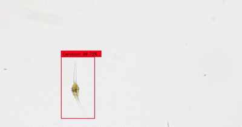

# Comparison of Object Detection and Semantic Detection in Protists

----------------------------------
## In the project we used the programming language Python and it works in Colaba.

# To make annotations on images:(VIA.html)

Annotations are made on the images through a file (VIA.html)
through which the images are uploaded and the label is written 
and the type is chosen, whether it is a rectangle to make (Object Detection - YOLO)
or Polygon to make (Simatic Detection - UNet)

# Augmentations and YOLOv3 training and UNet training: (YOLO3.ipynb and UNet.ipynb)file 

The data is uploaded from the images and the csv file in which the annotations 
values are located on the dropbox site and then we choose the number of times 
augmentations on the one image and after that we run the code and the code works
 automatically by converting the csv file to xml and doing the Augmentations and 
training that includes the code (YOLO3.ipynb and UNet.ipynb) and in this code all 
the information is present. Just run the code.

Note: There will be a bug in the code in the Object detection training section, and its solution will be by doing the Runtime> Restart runtime

# Model results:(YOLOv3_prediction.ipynb) file

To see the results of the model, weights.h5 file and training images are uploaded
to the dropbox site, the code is uploaded, and the code is automatically verified. 
Just put the link at the beginning of the code and run it.
 And to run the code with the same data only run it 
